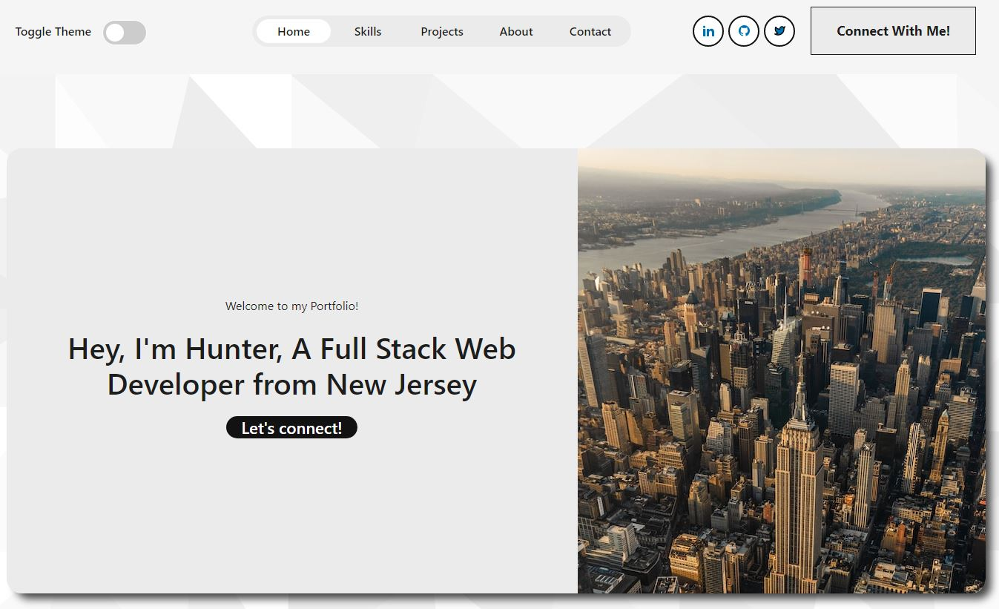

# Brennan.dev

### License
  
***

## Description
This is an application is my updated portfolio with current skills and projects listed in their respected sections. This project was created as an update to an older version of a portfolio I created in the past. The tools used are listed below with the most important one being React.
***

## Table of Contents
1. [Technologies Used](#technologies)
2. [Screenshots](#screenshots)
3. [Links](#links)
***

## Technologies Used
  
* HTML

* Bootstrap (CSS)

* React.js

* JavaScript

***

## Screenshots

***

## Links

[Deployed-Application](https://hunterbrennandev.netlify.app/)

[Repo-Link](https://github.com/HunterBrennan1/Brennan.dev)
***
